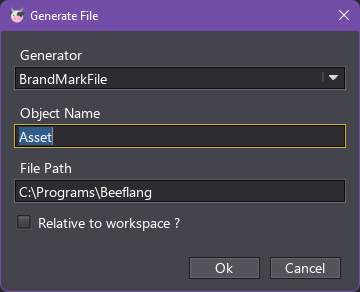

# BeefBrand
This program generates .bf files that contain a hardcoded version of your assets  
by using the build in Generator component from corlib

## Usage
Add the project to your Workspace.  
Change your dependencies to BeefBrand.  
Rightclick on your project.  
Generate File.  
Select BeefBrand from the dropdown.  
Input the name and the path.  
If relative is checked the path you input will be relative to the directory of your workspace.  

